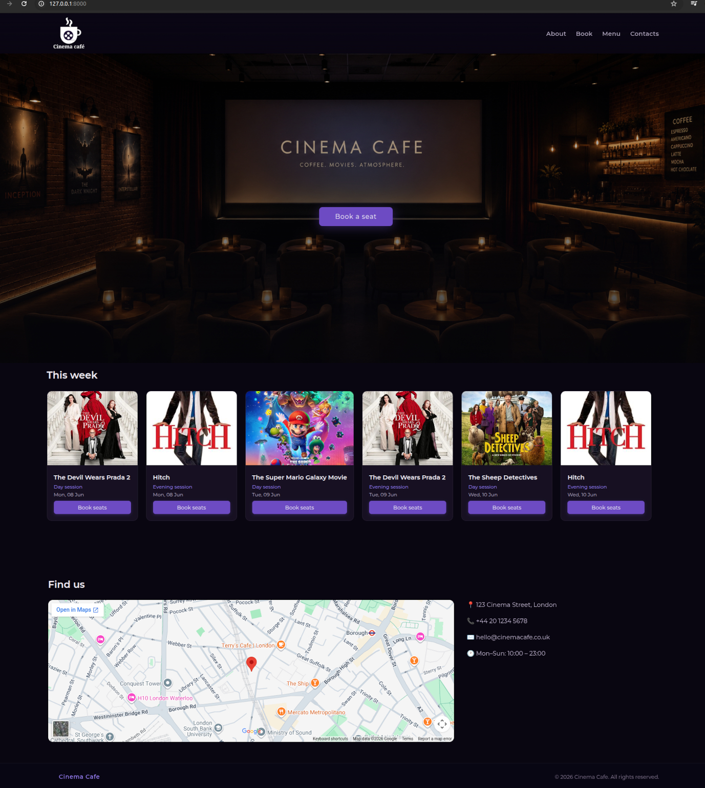
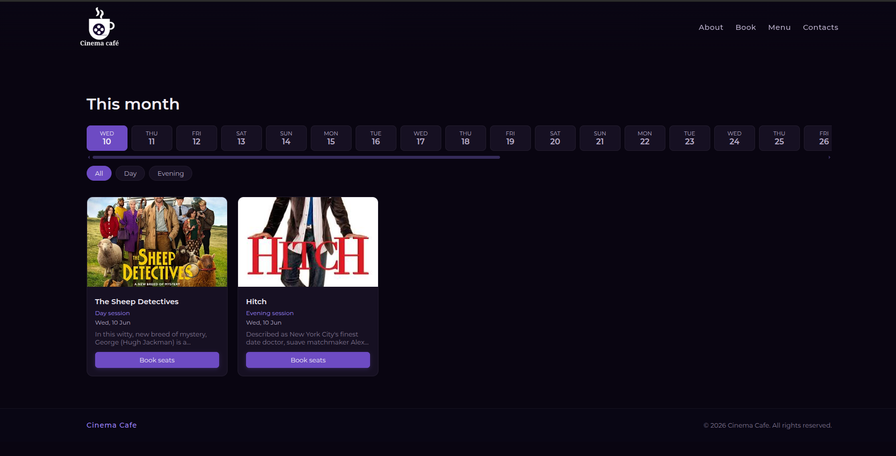
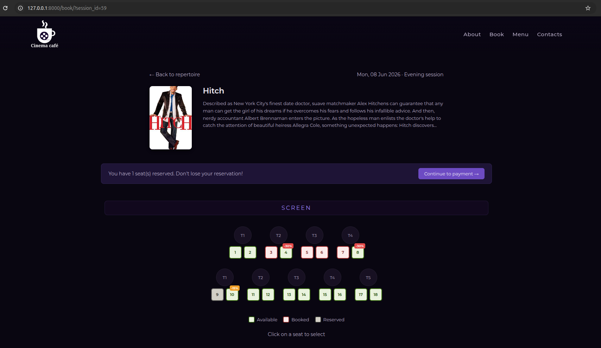
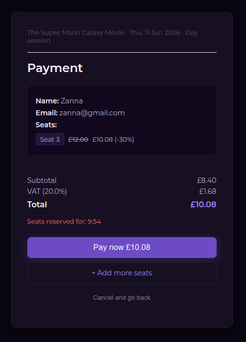
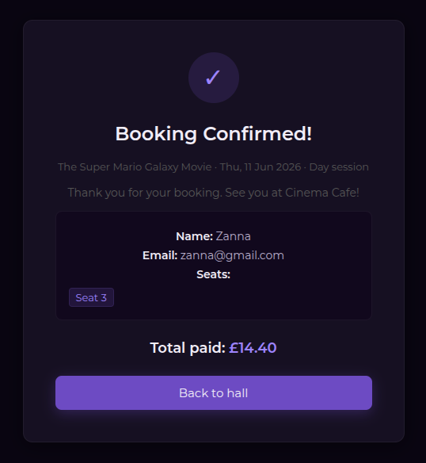
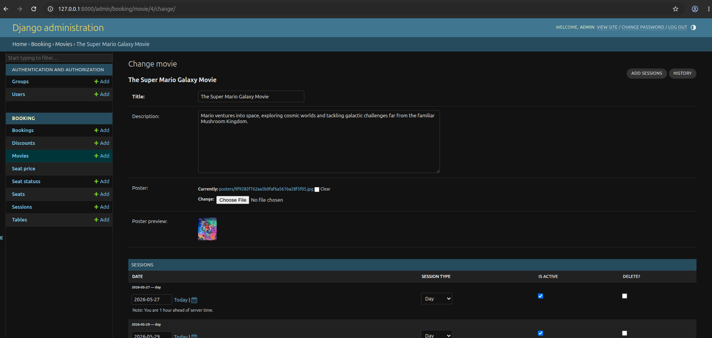

# Cinema-Café — Seat Booking System

A full-stack web application for managing table and seat reservations at a cinema-cafe. This application developed using Python/Django, MySQL, and JavaScript.
## Project Objectives
The main aim of this project was to create a user-friendly, interactive web application for a “cinema-cafe” that automates table/seats booking as well as optimises space usage.

## Screenshots

### Home Page


### Repertoire


### Movie Page


### Payment


### Booking Confirmation


### Admin Panel


## Features
### Customer Features
- View monthly repertoire with day/evening session filters
- Interactive seat selection
- Real-time seat availability updates every 10 seconds
- Colour-coded seating plan (green — available, red — booked, blue- selected, grey — reserved)
- Automatic 10-minute seat reservation with expiry
- Discount logic for odd number of seats (by default 15%)
- Discount badges for isolated seats (by default 30%)
- Booking confirmation process
- Payment page

### Administration Features
- Custom admin panel for managing movies, sessions, discounts and pricing
- Manage bookings
- Manage tables and seats
- Manage employees

## Technology Stack

- Python 3.12 (Backend language)
- Django 4.2 (Web framework)
- MySQL/MariaDB (Database)
- Django ORM (Database interaction and data management)
- JavaScript (Real-time updates, booking logic)
- CSS3 and Montserrat font (Styling)
- HTML5 (Templates)

## Installation

### Prerequisites
- Python 3.10+
- MySQL or MariaDB
- pip

### Setup

1. Clone the repository:
```bash
git clone https://github.com/your-username/cinema-cafe.git
cd cinema-cafe
```

2. Create and activate virtual environment:
```bash
python3 -m venv venv
source venv/bin/activate
```

3. Install dependencies:
```bash
pip install django mysqlclient python-dotenv Pillow
```

4. Create `.env` file in the project root:
SECRET_KEY=your-secret-key
DB_NAME=cinema_cafe
DB_USER=your-db-user
DB_PASSWORD=your-db-password
DB_HOST=127.0.0.1
DB_PORT=3306

5. Set up database and run:
```bash
python manage.py migrate
python manage.py loaddata booking/fixtures/initial_data.json
python manage.py createsuperuser
python manage.py runserver
```
6. Open in browser: `http://YOUR_LOCAL_IP:8000`
